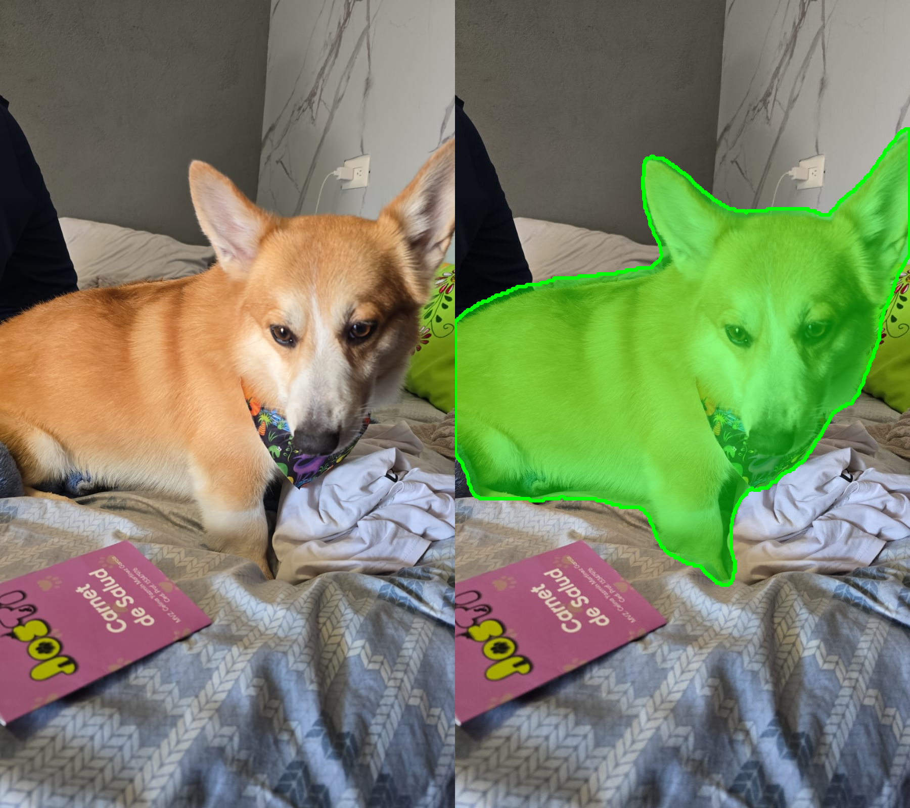

# Abbadon Engine

A C++ / LibTorch inference engine for the two vision models of the **Mendicant Bias** system:

- **Daowa-maad** — segmentation oracle. Takes an RGB image and predicts a pet mask.
- **Mendicant Bias** — classifier. Takes the RGB image **plus** Daowa-maad's mask and decides **cat or dog**.

The models were designed and trained in Python/PyTorch and exported to TorchScript.
This repo does **not** train anything: it loads the exported `.pt` files and runs the whole
pipeline in C++ on the GPU, with no Python at runtime.

```
image ─► preprocessing ─► Daowa-maad ─► sigmoid mask ─┐
  │        (OpenCV)                                    ├─► Mendicant Bias ─► cat / dog
  └────────── normalized RGB tensor ──────────────────┘
```



## Pipeline

| Step | What happens |
|---|---|
| 1. Load | `cv::imread` → BGR, `uint8`, any size |
| 2. Preprocess | BGR → RGB · resize to 384×384 (`INTER_LINEAR`, same as training) · to GPU as `uint8` · HWC → CHW · `/255` · ImageNet normalization · batch dim → `[1, 3, 384, 384]` |
| 3. Segment | Daowa-maad → logits `[1, 1, 384, 384]` → sigmoid (no threshold) |
| 4. Classify | Mendicant Bias `forward(rgb, mask)` → logits `[1, 2]` → `0 = cat`, `1 = dog` |
| 5. Visualize | Mask upscaled to the original size, green overlay + contour saved next to the input image |

## Requirements

- Linux or **WSL2** (developed on Ubuntu 24.04 under WSL2)
- NVIDIA GPU + driver (developed on an RTX 5070 Ti, `sm_120`)
- CUDA Toolkit **13.0** at `/usr/local/cuda-13.0`
- CMake ≥ 3.18, g++ (C++20)
- OpenCV for C++: `sudo apt install libopencv-dev`
- Python 3.12 (only to get LibTorch through pip)

## Setup

### 1. LibTorch (through a Python venv)

LibTorch comes bundled inside the `torch` pip wheel, so there is no separate zip to download:

```bash
python3 -m venv env_engine
source env_engine/bin/activate
pip install torch==2.12.1 --index-url https://download.pytorch.org/whl/cu130
```

### 2. Weights

The `.pt` files are larger than 100 MB, so they are **not** in the repo.
Put them in `weights/`:

```
weights/
├── Daowa_Oracle_Frozen.pt
└── mendicant_bias_cpp.pt
```

> Use `Daowa_Oracle_Frozen.pt`: it is the checkpoint that generated the masks Mendicant Bias was trained on.

### 3. ⚠️ Deactivate conda

If conda is active, its own compiler (GCC 15) and its own `nvcc` end up in `PATH` and break
`find_package(Torch)`. Before building:

```bash
conda deactivate
```

## Build and run

The easy way — `setup.sh` configures CMake (first time only), builds, runs the tests and,
**only if they pass**, runs the engine:

```bash
chmod +x setup.sh        # only once
./setup.sh images/fredo.jpeg
```

Output:

```
gato confidence: 0.0152699%.
perro confidence: 99.9847%.
Mendicant Bias output: perro
Saved: images/fredo_mask.png and images/fredo_overlay.png
```

### Manual build

```bash
cmake -S . -B build \
  -DCMAKE_PREFIX_PATH=$(pwd)/env_engine/lib/python3.12/site-packages/torch/share/cmake/Torch \
  -DCUDA_TOOLKIT_ROOT_DIR=/usr/local/cuda-13.0 \
  -DCMAKE_CUDA_COMPILER=/usr/local/cuda-13.0/bin/nvcc \
  -DCMAKE_CUDA_ARCHITECTURES=120 \
  -DTORCH_CUDA_ARCH_LIST="12.0"

cmake --build build -j
./build/engine images/fredo.jpeg
```

| Flag | Why |
|---|---|
| `CMAKE_PREFIX_PATH` | Where `TorchConfig.cmake` lives (inside the venv) |
| `CUDA_TOOLKIT_ROOT_DIR` | Torch's CMake uses the legacy `FindCUDA`, which reads this variable (not `CUDAToolkit_ROOT`) |
| `CMAKE_CUDA_COMPILER` | Without it, CMake can't find `nvcc` outside conda |
| `TORCH_CUDA_ARCH_LIST` | Target GPU architecture (`12.0` = Blackwell / RTX 50xx). Change it for other GPUs |

The warnings about `kineto` and `CMAKE_CUDA_ARCHITECTURES` being ignored are harmless.

## Tests

`engine_tests` turns every check of the pipeline into an automatic PASS/FAIL:
CUDA, model loading, preprocessing (channel order, shapes, dtypes, contiguity, normalization range),
Daowa-maad's mask, and Mendicant Bias predictions (the dog photo → dog, the cat photo → cat).

```bash
./build/engine_tests
# or
ctest --test-dir build --output-on-failure
```

Run them from the project root: the paths to `weights/` and `images/` are relative.

## Project structure

```
abbadon_engine/
├── CMakeLists.txt
├── setup.sh                  # configure + build + tests + run
├── include/abbadon/          # headers (declarations)
│   ├── check.hpp
│   └── processors.hpp
├── src/
│   ├── engine.cpp            # main program
│   ├── elements/             # implementations
│   │   ├── check.cpp
│   │   └── processors.cpp
│   └── tests/
│       └── test_engine.cpp
├── images/                   # sample inputs (outputs are git-ignored)
└── weights/                  # .pt files (git-ignored)
```

## Roadmap

- [x] Phase 0 — Setup: CMake + LibTorch + CUDA on WSL2
- [x] Phase 1 — Daowa-maad running on the GPU
- [x] Phase 2 — Real preprocessing with OpenCV (matching the training pipeline)
- [x] Phase 3 — Full pipeline: Daowa-maad → mask → Mendicant Bias → cat/dog
- [ ] Phase 3.5 — Refactor into a reusable engine (functions/classes + library)
- [ ] Phase 4 — Validate outputs number by number against the Python implementation
- [ ] Phase 5 — Latency benchmark (CPU vs GPU, with warm-up)
- [ ] Future — Custom CUDA kernels where profiling says it matters (e.g. a fused preprocessing kernel)
